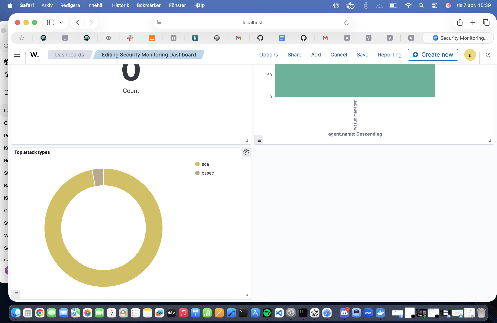

cat > README.md <<'EOF'
# 🔐 ICS/SCADA Security Lab

> Simulating real-world attacks in industrial control systems using Docker, Modbus and IDS detection.

---

## 🚀 Overview

This project demonstrates a segmented ICS environment with IT, DMZ, and OT zones.

The objective was to simulate a realistic cyber attack where an attacker:
- pivots through a jump server
- accesses an OT system
- modifies process data using Modbus
- gets detected using Suricata IDS

Industrial Control Systems are critical infrastructure and often lack strong security controls  [oai_citation:1‡Wikipedia](https://en.wikipedia.org/wiki/Control_system_security?utm_source=chatgpt.com).

---

## 🏗️ Architecture

| Zone | Role |
|------|------|
| IT | Attacker machine |
| DMZ | Jump server |
| OT | Modbus server |

Security model:
- No direct IT → OT access
- Controlled via firewall
- Jump server required for access

---

## ⚔️ Attack Scenario

Steps:

1. Gain access to jump server  
2. Pivot into OT network  
3. Send Modbus write command  
4. Modify register value  

This shows how trust between zones can be abused.

---

## 📸 Screenshots

### 🔴 Attack
Modbus write attack executed


---

### 📡 tcpdump
Captured Modbus traffic


---

### 🚨 Suricata Alert
IDS detecting attack


---

### 📜 Detection Rule
Custom rule used



---

### 🔥 Firewall
Network segmentation rules


---

## 🧪 Detection

Custom Suricata rule:

```bash
alert tcp any any -> any 502 (msg:"MODBUS WRITE DETECTED"; content:"|00 06|"; sid:1000001;)
