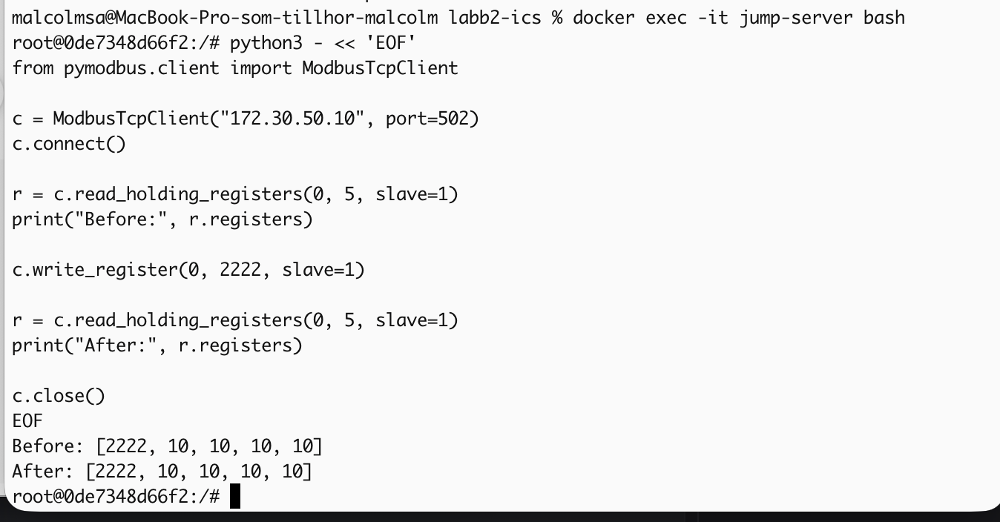
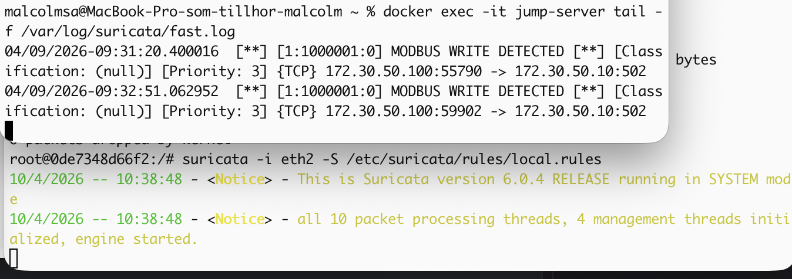
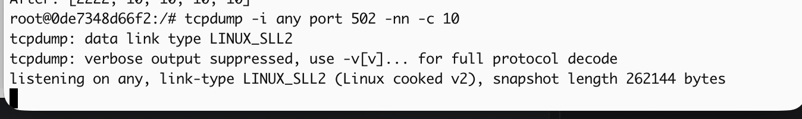
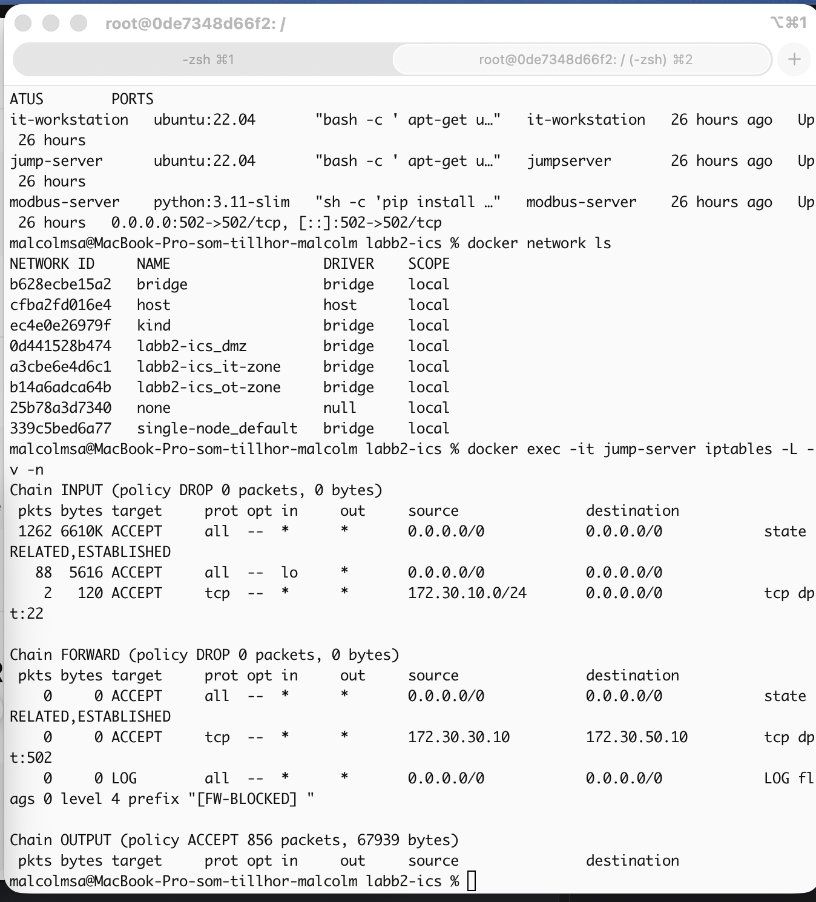
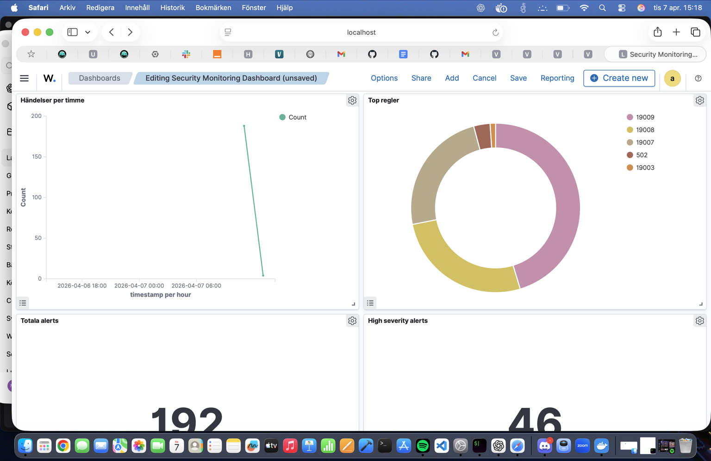

# ICS/SCADA Security Lab

## Översikt

Detta projekt demonstrerar en segmenterad ICS/SCADA-miljö byggd med Docker för att simulera industriell cybersäkerhet och OT-säkerhet i praktiken.

Miljön är uppdelad i tre separerade zoner enligt Purdue-modellen:

- IT-zon
- DMZ-zon
- OT-zon

Projektets mål var att undersöka hur nätverkssegmentering, övervakning och detektion kan skydda industriella system mot obehörig åtkomst och attacker.

---

## Purdue-modell och nätverkssegmentering

Arkitekturen implementerades enligt Purdue-modellen med tydlig separation mellan IT och OT.

```text
IT Zone
   |
   v
DMZ / Jump Server
   |
   v
OT Zone (OpenPLC + ScadaBR)
```

All trafik mellan zonerna kontrolleras genom brandväggsregler och segmentering.

---

## Säkerhetsarkitektur

Följande säkerhetsåtgärder implementerades:

- Segmentering mellan IT, DMZ och OT
- Brandväggsregler enligt principen "deny all, allow explicit"
- Jump server för kontrollerad åtkomst till OT-zonen
- IDS-övervakning med Suricata
- Trafikanalys med tcpdump
- Logginsamling och övervakning med Wazuh

Målet var att skapa en realistisk industriell miljö med flera säkerhetslager.

---

## Använda verktyg

- Docker
- Docker Compose
- OpenPLC
- ScadaBR
- Suricata IDS
- tcpdump
- Wazuh
- iptables
- pymodbus

---

## Attackscenario

Ett simulerat Modbus TCP-angrepp genomfördes från IT-zonen mot OT-zonen via DMZ.

Attacken försökte manipulera registervärden i PLC-miljön. Suricata detekterade den misstänkta trafiken och genererade larm som verifierades med tcpdump.

---

## Incidentrapport

### Tidslinje

1. Angriparen initierade Modbus-kommunikation från IT-zonen.
2. Trafiken passerade via DMZ och jump server.
3. Ett write-kommando skickades mot OT-zonen.
4. Suricata genererade en säkerhetsvarning.
5. Trafiken verifierades med tcpdump.
6. Händelsen analyserades och dokumenterades.

### Containment

- Trafiken begränsades genom brandväggsregler.
- Åtkomst till OT-zonen sker endast via DMZ.

### Recovery

- Systemets konfiguration verifierades.
- Säkerhetsregler uppdaterades vid behov.
- Loggar sparades för vidare analys.

---

## Riskanalys enligt IEC 62443

| Risk | Sannolikhet | Konsekvens | Åtgärd |
|------|------------|------------|--------|
| Obehörig åtkomst till OT | Medel | Hög | Segmentering och DMZ |
| Modbus utan autentisering | Hög | Hög | IDS-regler och övervakning |
| Lateral movement från IT | Medel | Hög | Brandvägg och nätverksisolering |
| Manipulation av PLC-data | Medel | Hög | Detektion med Suricata |

Bedömningen visar att segmentering och övervakning minskar riskerna avsevärt.

---

## Screenshots

### Attack mot OT-zon



### Suricata Alert



### tcpdump Analys



### Brandväggsregler



### Dashboard och övervakning



---

## Utmaningar och lösningar

Projektet innehöll flera tekniska utmaningar:

- Docker-nätverk och routing mellan zoner
- Modbus-kommunikation mellan containrar
- IDS-regler som inte triggade korrekt
- Brandväggsregler som blockerade trafik

För att lösa problemen användes:

- tcpdump för trafikanalys
- Docker logs för felsökning
- Anpassade Suricata-regler
- Stegvis verifiering av nätverkskommunikation

---

## Slutsats

Projektet demonstrerar hur nätverkssegmentering, IDS-övervakning och säkerhetskontroller kan användas för att skydda industriella system.

Labben gav praktisk erfarenhet av:

- ICS/SCADA-säkerhet
- OT-arkitektur
- Attackdetektion
- Incidenthantering
- Riskanalys enligt IEC 62443
