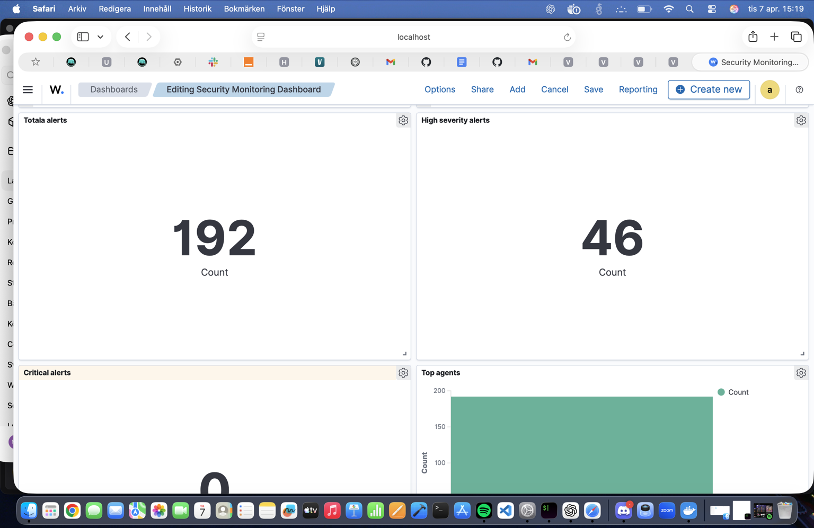
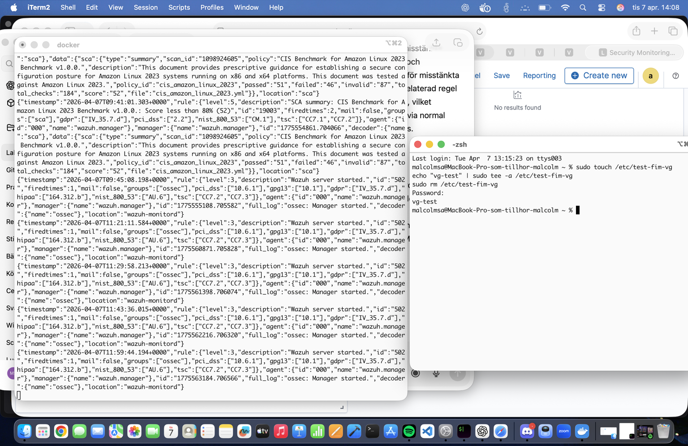

# Lab 1 – Centraliserad säkerhetsövervakning med Wazuh

## Introduction

I detta projekt implementerade jag en centraliserad säkerhetsövervakningsmiljö med hjälp av Wazuh och Docker. Syftet med projektet var att samla in loggar, analysera säkerhetshändelser, upptäcka attacker samt visualisera och hantera alerts i realtid.

Projektet inkluderar:

- Wazuh Manager
- Wazuh Dashboard
- Wazuh Indexer
- Wazuh Agent
- Egna custom rules
- File Integrity Monitoring (FIM)
- AI-baserad anomalidetektion
- Automatiserad incidentrespons
- Dokumentation och evidens

---

# System Architecture

Miljön är uppbyggd enligt en klassisk SIEM-arkitektur där flera komponenter arbetar tillsammans för att upptäcka och analysera säkerhetshot.

## Wazuh Agent

Wazuh-agenten installeras på klienten och ansvarar för att samla in:

- systemloggar
- filändringar
- kommandon
- säkerhetshändelser
- systemaktivitet

Informationen skickas därefter vidare till Wazuh Manager.

---

## Wazuh Manager

Wazuh Manager analyserar inkommande loggar och jämför dem mot definierade regler. När misstänkt aktivitet identifieras genereras en alert.

Exempel på detektioner:

- misslyckade inloggningar
- filändringar
- misstänkta kommandon
- nätverksaktivitet
- simulerade attacker

---

## Wazuh Dashboard

Dashboarden används för att visualisera:

- alerts
- severity levels
- aktiva agenter
- threat hunting
- File Integrity Monitoring
- säkerhetshändelser i realtid

Dashboarden användes kontinuerligt för att verifiera att miljön fungerade korrekt.

---

# Detection Rules

Projektet innehåller egna custom rules i:

```text
configs/local_rules.xml





 
